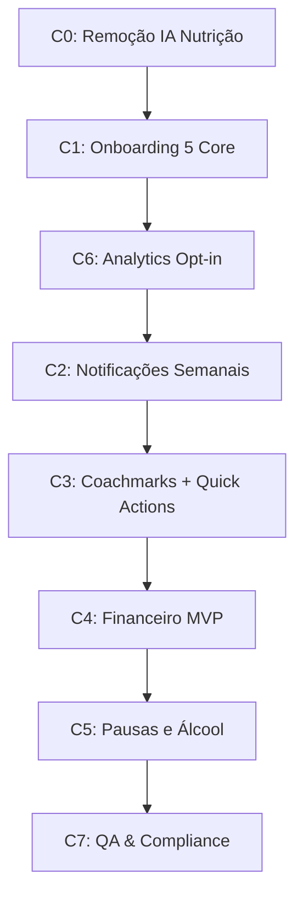

# Planejamento de Refatoração - Pinpoint GLP-1

**Data:** 2025-11-12
**Branch Base:** `claude/planeje-es-011CV4C8NWiX3LEFu6yWTZRQ`
**Status:** Em Planejamento

---

## Índice

1. [Guardrails e Convenções](#guardrails-e-convenções)
2. [Visão Geral das Fases](#visão-geral-das-fases)
3. [C0 - Remoção da IA de Nutrição](#c0---remoção-da-ia-de-nutrição-p0)
4. [C1 - Onboarding Core](#c1---onboarding-core-5-telas--hooks-p1)
5. [C2 - Notificações Semanais](#c2---notificações-semanais-p1)
6. [C3 - Coachmarks + Quick Actions](#c3---coachmarks--quick-actions-p1)
7. [C4 - Financeiro MVP](#c4---financeiro-mvp-p1)
8. [C5 - Pausas e Álcool](#c5---pausas-e-álcool-p1)
9. [C6 - Analytics Opt-in](#c6---analytics-opt-in-p1)
10. [C7 - QA & Compliance](#c7---qa--compliance-p0p1)
11. [Ordem de Execução](#ordem-de-execução-sugerida)
12. [Riscos e Mitigações](#riscos-e-mitigações)

---

## Guardrails e Convenções

### Stack Técnica
- **Framework:** Expo SDK 54 + React Native 0.81.5
- **Linguagem:** TypeScript 5.9 (strict mode)
- **Roteamento:** Expo Router 6.0 (file-based)
- **Plataformas:** iOS + Android
- **Idioma:** PT-BR
- **Formato de horário:** 24h
- **Moeda:** BRL (R$)

### Acessibilidade
- **Contraste mínimo:** 4.5:1 (AA)
- **Áreas de toque:** ≥ 44×44 pixels
- **SafeArea:** Sempre usar `SafeAreaView` ou `useSafeAreaInsets`
- **Dark Mode:** Respeitar preferências do sistema
- **Ícones:** `phosphor-react-native` exclusivamente
- **Sem emojis:** Proibido uso de emojis em TODO o app (código, UI, notificações). Tom clínico e neutro sempre.

### Analytics & Privacidade
- **Analytics:** Opt-in obrigatório antes de rastrear
- **LGPD:** Disclaimer visível + consentimento explícito
- **Dados sensíveis:** Nunca em eventos de analytics sem consentimento

### Desenvolvimento
- **Branches:** Feature branches por ciclo (`cleanup/*`, `feature/*`, `refactor/*`, `release/*`)
- **PRs:** Pequenos, focados, com checklist de QA
- **Testes:** Validação manual iOS/Android para cada PR
- **Linters:** ESLint + Prettier devem passar antes do merge

### Offline-First
- **Persistência local:** Fila de operações pendentes (dose, peso, compra) em AsyncStorage
- **Sincronização:** Retry automático com exponential backoff
- **Estados visuais:** Indicadores de "sincronizando..." / "falhou" / "sincronizado"
- **Resolução de conflitos:** Last-write-wins baseado em timestamps UTC
  - Casos de borda: eventos simultâneos (dose/peso/compra) em múltiplos dispositivos → timestamp UTC define vencedor
  - Exemplo: Aplicação registrada às 19:00:15 no dispositivo A e 19:00:20 no B → registro de B prevalece (mais recente)
- **Cache:** Dados críticos (medicação, preferências) sempre disponíveis offline

### Checklist de Cópia Clínica - Glossário Aprovado

| Termo Preferido | Evitar | Contexto |
|----------------|--------|----------|
| Medicamento GLP-1 | "Remédio", "Droga" | Sempre |
| Semaglutida / Tirzepatida / Retatrutida | Marcas sem genérico | Priorizar nome genérico |
| Aplicação | "Injeção" (quando soar agressivo) | Registro da dose |
| Perda de peso | "Emagrecimento", "Definição" | Linguagem neutra, clínica |
| "Consulte seu médico" | "Fale com especialista" | Disclaimers |

**Reforço:**
- **Sem emojis:** Proibido em TODO o app (código, UI, notificações, push notifications)
- **Tom clínico:** Neutro, profissional, baseado em dados
- **Priorizar genérico:** Sempre que possível, usar nome genérico + marca entre parênteses

---

## Visão Geral das Fases

| Fase | Prioridade | Esforço | Dependências | Branch |
|------|-----------|---------|--------------|--------|
| C0 | P0 | 4h | Nenhuma | `cleanup/remove-nutrition-ai` |
| C1 | P1 | 20h | C0 | `refactor/onboarding-5-core` |
| C2 | P1 | 7h | C1 | `feature/weekly-reminders` |
| C3 | P1 | 8h | C1, C2 | `feature/coachmarks-home` |
| C4 | P1 | 25h | C1 | `feature/finance-mvp` |
| C5 | P1 | 12h | C1, C2 | `feature/pauses-alcohol` |
| C6 | P1 | 6h | C1 | `feature/analytics-optin` |
| C7 | P0/P1 | 8h | Todos | `release/qa-compliance` |

**Total estimado:** ~90h (2-3 semanas full-time ou 4-5 semanas part-time)

**Ajustes de esforço:**
- **C1:** 16h → 20h (validações, estados de erro, deferred sign-up)
- **C2:** 6h → 7h (edge cases de timezone/DST, janela de aplicação, catch-up)
- **C4:** 20h → 25h (schema rico, storage de recibos, formatação BRL, opt-in R$/kg)

---

## C0 - Remoção da IA de Nutrição (P0)

### Objetivo
Remover completamente a feature de IA de nutrição (Gemini) do app, incluindo arquivos, dependências, rotas e dados.

### Branch
`cleanup/remove-nutrition-ai` (a partir de `claude/planeje-es-011CV4C8NWiX3LEFu6yWTZRQ`)

### Análise do Estado Atual

**Arquivos identificados para remoção:**
```
lib/gemini.ts                                    (118 linhas)
hooks/useGeminiChat.ts                           (89 linhas)
hooks/useNutrition.ts                            (130 linhas)
components/nutrition/NutritionCard.tsx
components/nutrition/ConfirmationModal.tsx
components/nutrition/AudioRecorder.tsx
components/nutrition/ChatMessage.tsx
components/nutrition/InstructionsCard.tsx
app/(tabs)/add-nutrition.tsx
```

**Referências em outros arquivos:**
- `app/(tabs)/_layout.tsx`: Aba "AI" (sparkle icon) + rota `/add-nutrition`
- `app/(tabs)/calendar.tsx`: Possíveis referências a nutrition events
- `components/dashboard/TodaySection.tsx`: Pode exibir dados de nutrição
- `lib/auth.ts`: Script de deleção de dados pode referenciar `daily_nutrition`
- `lib/types.ts`: Tipos relacionados a nutrição
- `lib/analytics.ts`: Eventos `nutrition_*` (se existirem)

**Dependências:**
- `@google/generative-ai`: ^0.24.1 (package.json linha 21)
- Variável de ambiente: `EXPO_PUBLIC_GEMINI_API_KEY`

**Banco de dados:**
- Tabela: `daily_nutrition` (migration 008_daily_nutrition.sql)

### Tarefas Detalhadas

#### 1. Análise de Impacto (1h)
- [ ] Executar grep completo para encontrar todas as referências
  ```bash
  grep -r "nutrition\|Nutrition\|NUTRITION\|gemini\|Gemini\|GEMINI" --exclude-dir=node_modules
  ```
- [ ] Mapear todas as dependências entre componentes
- [ ] Verificar se há feature flags relacionadas

#### 2. Remoção de Arquivos (1h)
- [ ] Deletar `lib/gemini.ts`
- [ ] Deletar `hooks/useGeminiChat.ts`
- [ ] Deletar `hooks/useNutrition.ts`
- [ ] Deletar `components/nutrition/` (diretório completo)
- [ ] Deletar `app/(tabs)/add-nutrition.tsx`

#### 3. Atualização de Rotas e Navegação (30min)
- [ ] Editar `app/(tabs)/_layout.tsx`:
  - Remover aba "AI" (sparkle icon)
  - Remover import de `add-nutrition`
  - Ajustar índices das abas restantes

#### 4. Limpeza de Imports e Referências (1h)
- [ ] Editar `app/(tabs)/calendar.tsx` (remover referências a nutrition)
- [ ] Editar `components/dashboard/TodaySection.tsx` (remover nutrition card)
- [ ] Editar `lib/types.ts` (remover tipos relacionados)
- [ ] Editar `lib/analytics.ts` (remover eventos `nutrition_*`)
- [ ] Editar `lib/auth.ts` (remover referências em scripts de deleção)

#### 5. Remoção de Dependências (15min)
- [ ] Editar `package.json`: remover `@google/generative-ai`
- [ ] Executar `npm install` para atualizar `package-lock.json`
- [ ] Editar `.env.example`: remover linha `EXPO_PUBLIC_GEMINI_API_KEY=`
- [ ] Atualizar README.md (remover seção de API Key do Gemini)

#### 6. Limpeza de Banco de Dados (30min)
- [ ] Criar migration para dropar tabela `daily_nutrition`:
  ```sql
  -- supabase/migrations/XXX_drop_daily_nutrition.sql
  drop table if exists daily_nutrition cascade;
  ```
- [ ] Executar migration em development
- [ ] Documentar migração para produção (se aplicável)

#### 7. Validação (30min)
- [ ] Executar `npm run type-check` (zero erros)
- [ ] Executar `npm run lint` (zero erros)
- [ ] Build iOS: `npx expo run:ios` (sucesso)
- [ ] Build Android: `npx expo run:android` (sucesso)
- [ ] Testar navegação entre abas (sem crashes)
- [ ] Verificar se não há referências quebradas

### Definition of Done
- ✅ Nenhum arquivo relacionado a nutrição/gemini existe no projeto
- ✅ Nenhuma referência a nutrição em imports ou código
- ✅ Dependência `@google/generative-ai` removida
- ✅ Variável `EXPO_PUBLIC_GEMINI_API_KEY` removida
- ✅ Aba de IA removida da navegação
- ✅ App compila sem erros em iOS e Android
- ✅ Linters (TypeScript + ESLint) passam
- ✅ README e .env.example atualizados
- ✅ PR criado com checklist de validação

### Riscos
- **Baixo:** Feature isolada, sem dependências críticas
- **Atenção:** Verificar se usuários existentes têm dados em `daily_nutrition` (considerar migração de dados se necessário)

---

## C1 - Onboarding Core (5 telas) + Hooks (P1)

### Objetivo
Refatorar o onboarding atual (23 telas) para um fluxo essencial de 5 telas core, com hooks opcionais entre passos que **não coletam dados** e **não alteram o progresso**.

### Branch
`refactor/onboarding-5-core` (a partir de `cleanup/remove-nutrition-ai`)

### Análise do Estado Atual

**Onboarding atual:**
- 23 telas implementadas em `components/onboarding/` (27 arquivos)
- Fluxo gerenciado por `app/(auth)/onboarding-flow.tsx` (618 linhas)
- Hook de persistência: `hooks/useOnboarding.ts` (310 linhas)
- Feature flags: `FF_ONBOARDING_23` (true), `FF_ONBOARDING_CORE8` (false)
- Progress tracking via AsyncStorage (`@mounjaro:onboarding_progress`)

**Problemas identificados:**
- Muito longo (23 passos, ~10-15 minutos)
- Inclui frequência "diária" (não aplicável a GLP-1)
- Doses não são condicionadas por medicamento
- Mistura coleta de dados com educação
- Não tem hooks entre passos (como custos, álcool, pausas)

### Novo Fluxo Proposto

#### 5 Telas Core

1. **Welcome** (`app/(onboarding)/Welcome.tsx`)
   - Boas-vindas e introdução ao app
   - Valor de proposta: "Acompanhe seu tratamento com Mounjaro/Retatrutida"
   - CTA: "Começar"

2. **Compliance** (`app/(onboarding)/Compliance.tsx`)
   - Disclaimer clínico (não substitui médico)
   - Consentimento LGPD (opt-in para analytics)
   - Checkbox obrigatório: "Li e aceito os termos"
   - Persistir: `consentVersion`, `consentAcceptedAt`, `analyticsOptIn`

3. **MedicationDose** (`app/(onboarding)/MedicationDose.tsx`)
   - **Passo 1:** Selecionar medicamento
     - Opções: Mounjaro, Retatrutida, Ozempic, Saxenda, Wegovy, Zepbound, Outro
     - Destacar: Mounjaro e Retatrutida (badges "Popular" ou "Novo")
   - **Passo 2:** Selecionar dose **condicionada ao medicamento**
     - Mounjaro: 2.5, 5, 7.5, 10, 12.5, 15 mg
     - Retatrutida: 2, 4, 6, 8, 10, 12 mg
     - Outros: doses específicas de cada medicamento
   - **Regra crítica:** Sem opção "diária" (apenas semanal para GLP-1)
   - Persistir: `medication`, `dosage`, `frequency: 'weekly'`

4. **Schedule** (`app/(onboarding)/Schedule.tsx`)
   - Perguntar: "Qual dia da semana você aplica?"
     - Seletor de dia (seg-dom)
   - Perguntar: "Que horas prefere ser lembrado?"
     - Time picker (formato 24h)
   - Mostrar preview: "Próxima aplicação: Sexta, 18:00"
   - Persistir: `preferredDay` (0-6), `preferredTime` (HH:mm)

5. **Permissions** (`app/(onboarding)/Permissions.tsx`)
   - Solicitar permissão de notificações (gracioso, não bloqueante)
   - Explicar benefícios: "Nunca esqueça sua dose semanal"
   - Botões: "Permitir Notificações" / "Pular"
   - Se permitir: agendar primeira notificação semanal

#### Hooks Entre Passos (Opcionais)

**Hook: FeatureHook** (`app/(onboarding)/FeatureHook.tsx`)
- **Quando:** Entre Schedule e Permissions
- **Propósito:** Apresentar features opcionais (Custos, Álcool, Pausas)
- **Comportamento:**
  - Cards informativos (não formulários)
  - Botão: "Ver Depois" (continua sem coletar dados)
  - Não altera o progresso do onboarding
  - Apenas informa que as features existem

#### Deferred Sign-Up (Modo Convidado)

**Objetivo:** Permitir que usuários explorem o app sem criar conta, pedindo cadastro apenas após demonstrar valor real.

**Implementação:**
- Usuário pode completar onboarding (C1) e configurar lembretes (C2) sem login
- Dados armazenados localmente em AsyncStorage com flag `isGuestMode: true`
- **SEM LIMITES RÍGIDOS:** Não impor "7 dias" ou "5 registros" - deixar usuário explorar livremente
- Solicitar conta em momentos de alto valor:
  1. **Ao final do onboarding:** Modal suave "Criar conta para backup automático" (pode pular)
  2. **Ao registrar primeira compra (C4):** Obrigatório para persistir dados financeiros sensíveis
  3. **Ao ativar "Backup e sincronização":** Se usuário explicitamente pedir sync entre dispositivos
- **Migração de dados:** Ao criar conta, migrar todos os dados locais para Supabase:
  - Medicação e doses
  - Lembretes configurados
  - Aplicações registradas (se houver)
  - Pesos registrados (se houver)
- **UX de migração:**
  - Loading: "Sincronizando seus dados..."
  - Sucesso: "Tudo pronto! Seus dados estão seguros."
  - Erro: Retry com opção de contatar suporte

**Regras:**
- Modo convidado SEM limites de tempo ou registros
- Analytics: eventos de modo convidado **APENAS em logs locais** (não enviados para rede sem opt-in)
- Notificações funcionam normalmente (locais, sem push remoto)
- Dados locais persistem indefinidamente até usuário limpar cache ou desinstalar app

#### Copy Clínica e Linguagem

**Princípios:**
- **PT-BR formal:** Tom profissional, sem gírias ou informalidade excessiva
- **Sem emojis:** Proibido em todo o app (código, UI, notificações) - tom clínico e neutro sempre
- **Linguagem clara:** Evitar jargões médicos sem explicação
- **Foco em dados, não marketing:** "Registre sua aplicação" (não "Dê um passo na sua jornada!")

**Doses condicionadas:**
- Lista de doses muda dinamicamente conforme medicamento selecionado
- Validação: impedir doses inválidas para o medicamento escolhido
- Exemplo visual: Se Mounjaro → mostrar apenas [2.5, 5, 7.5, 10, 12.5, 15 mg]

#### Remote Config para Doses e Medicamentos

**Objetivo:** Permitir atualização de listas de medicamentos e doses sem necessidade de release de app.

**Implementação:**
- Usar Firebase Remote Config ou Supabase Table como fonte de verdade
- Schema de configuração:
  ```typescript
  interface MedicationConfig {
    id: string;
    name: string; // "Mounjaro", "Ozempic", etc.
    genericName: string; // "Tirzepatida", "Semaglutida"
    availableDoses: number[]; // [2.5, 5, 7.5, 10, 12.5, 15]
    unit: 'mg' | 'mL';
    frequency: 'weekly' | 'daily';
    featured: boolean; // destaque no onboarding
    enabled: boolean; // ativo/inativo
    updatedAt: string;
  }
  ```
- Fallback local: arquivo `constants/medications.ts` com configuração padrão
- Cache: AsyncStorage com TTL de 24h
- Sincronização: ao abrir app, tentar buscar config atualizada (silenciosamente)

**Tabela Supabase (alternativa a Firebase):**
```sql
create table medication_configs (
  id text primary key,
  name text not null,
  generic_name text not null,
  available_doses numeric[] not null,
  unit text not null default 'mg',
  frequency text not null default 'weekly',
  featured boolean default false,
  enabled boolean default true,
  updated_at timestamptz default now()
);

-- Popular com dados iniciais
insert into medication_configs (id, name, generic_name, available_doses, featured) values
('mounjaro', 'Mounjaro', 'Tirzepatida', ARRAY[2.5, 5, 7.5, 10, 12.5, 15], true),
('retatrutida', 'Retatrutida', 'Retatrutida', ARRAY[2, 4, 6, 8, 10, 12], true),
('ozempic', 'Ozempic', 'Semaglutida', ARRAY[0.25, 0.5, 1, 2], false);

-- RLS: leitura pública, escrita apenas admin
alter table medication_configs enable row level security;
create policy "public_read" on medication_configs for select using (true);
```

**Benefícios:**
- Adicionar novos medicamentos sem app update
- Ajustar doses rapidamente (ex: nova dosagem aprovada pela ANVISA)
- Desabilitar medicamentos descontinuados
- A/B testing de ordem de apresentação

### Estrutura de Arquivos

```
app/(onboarding)/
├── _layout.tsx                 # Layout do grupo onboarding
├── Welcome.tsx                 # Tela 1
├── Compliance.tsx              # Tela 2 (disclaimer + LGPD)
├── MedicationDose.tsx          # Tela 3 (medicamento + dose)
├── Schedule.tsx                # Tela 4 (dia + horário)
├── Permissions.tsx             # Tela 5 (notificações)
└── FeatureHook.tsx             # Hook entre Schedule e Permissions

hooks/
└── OnboardingContext.tsx       # Context para gerenciar estado

components/onboarding/
├── ProgressIndicator.tsx       # 5 dots indicando progresso
├── OnboardingButton.tsx        # Botão estilizado
├── DosageSelector.tsx          # Seletor de doses condicionadas
└── DayPicker.tsx               # Seletor de dia da semana
```

### Tarefas Detalhadas

#### 0. Pré-requisito: Gate de Design (Bloqueante)
**Saída obrigatória antes de iniciar C1:**
- [ ] Congelar design tokens no Stitch/Figma:
  - Cores (primárias, secundárias, feedback, dark mode)
  - Tipografia (famílias, tamanhos, pesos, line-heights)
  - Espaçamentos (4, 8, 12, 16, 24, 32, 48, 64)
  - Raios de borda (0, 4, 8, 12, 16, 999)
  - Sombras (elevação 1-5)
- [ ] Prancha de componentes base aprovados:
  - Botões (primary, secondary, tertiary, ghost)
  - Inputs (text, picker, checkbox)
  - Cards e containers
  - Ícones (Phosphor, set mínimo necessário)
- [ ] Documentação de tokens exportada (JSON ou constants file)
- [ ] Aprovação formal de design lead ou stakeholder

**Rationale:** Evitar retrabalho nas 5 telas do onboarding devido a mudanças de design durante implementação.

#### 1. Setup e Planejamento (2h)
- [ ] Criar feature flag `FF_ONBOARDING_5_CORE` (default: false)
- [ ] Criar branch `refactor/onboarding-5-core`
- [ ] Criar estrutura de pastas `app/(onboarding)/`
- [ ] Criar `OnboardingContext.tsx` para gerenciar estado

#### 2. Implementar Telas Core (8h)
- [ ] **Welcome.tsx** (1h)
  - Design: Ilustração + texto + botão
  - Ícones: Phosphor
  - Dark mode support
- [ ] **Compliance.tsx** (2h)
  - Disclaimer clínico (texto revisado por advogado/médico)
  - Checkbox LGPD obrigatório
  - Link para Política de Privacidade
  - Validação: só avança se aceitar
- [ ] **MedicationDose.tsx** (3h)
  - Tela 1: Grid de medicamentos (cards com ícones)
  - Tela 2: Doses condicionadas (lógica por medicamento)
  - Sem opção "diária"
  - Validação: dose válida para o medicamento
- [ ] **Schedule.tsx** (1h)
  - Day picker (seg-dom)
  - Time picker (24h)
  - Preview da próxima aplicação
- [ ] **Permissions.tsx** (1h)
  - UI graciosa (não assustadora)
  - Explicação clara dos benefícios
  - Botão "Pular" visível

#### 3. Implementar Hooks (2h)
- [ ] **FeatureHook.tsx** (2h)
  - Cards informativos: Custos, Álcool, Pausas
  - Apenas apresentação (sem coleta)
  - Botão: "Ver Depois"

#### 4. Context e Lógica de Fluxo (2h)
- [ ] Criar `OnboardingContext.tsx`:
  - Estado: `{ medication, dosage, preferredDay, preferredTime, consentVersion, consentAcceptedAt, analyticsOptIn }`
  - Funções: `nextStep()`, `prevStep()`, `saveData()`
- [ ] Implementar navegação entre telas
- [ ] Implementar persistência (AsyncStorage)

#### 5. Integração com Backend (2h)
- [ ] Atualizar `hooks/useOnboarding.ts`:
  - Ajustar `saveOnboardingData()` para novos campos
  - Adicionar `consentVersion`, `consentAcceptedAt`, `analyticsOptIn` na tabela `users`
- [ ] Criar migration se necessário:
  ```sql
  alter table users add column consent_version text;
  alter table users add column consent_accepted_at timestamptz;
  alter table users add column analytics_opt_in boolean default false;
  alter table users add column preferred_day int check (preferred_day >= 0 and preferred_day <= 6);
  alter table users add column preferred_time text;
  ```

#### 6. Testes e Validação (2h)
- [ ] Testar fluxo completo 1→5
- [ ] Testar navegação back/forward
- [ ] Testar validações (não avançar sem dados obrigatórios)
- [ ] Testar persistência (fechar app e reabrir)
- [ ] Testar dark mode
- [ ] Testar acessibilidade (contraste, touch areas)
- [ ] Testar iOS e Android

### Definition of Done
- ✅ 5 telas core implementadas e funcionais
- ✅ Hook entre passos (FeatureHook) implementado (sem coleta de dados)
- ✅ Sem frequência "diária" (apenas semanal)
- ✅ Doses condicionadas por medicamento (Mounjaro/Retatrutida em destaque)
- ✅ Persistência de dados: `preferredDay`, `preferredTime`, `consentVersion`, `consentAcceptedAt`, `analyticsOptIn`
- ✅ Confirmação de "Próxima aplicação" ao final
- ✅ Onboarding finaliza na Home (dashboard)
- ✅ PT-BR clínico e claro
- ✅ Ícones Phosphor
- ✅ Contraste AA (4.5:1)
- ✅ Dark mode funcional
- ✅ Builds iOS/Android sem erros
- ✅ Feature flag `FF_ONBOARDING_5_CORE` implementada

### Riscos
- **Médio:** Mudança significativa na UX (usuários podem estranhar fluxo mais curto)
- **Mitigação:** Feature flag permite rollback
- **Médio:** Migração de dados de onboarding antigo
- **Mitigação:** Manter compatibilidade com dados existentes

---

## C2 - Notificações Semanais (P1)

### Objetivo
Implementar sistema de notificações semanais confiável para lembretes de aplicação do medicamento, integrando com o onboarding e configurações do usuário.

### Branch
`feature/weekly-reminders` (a partir de `refactor/onboarding-5-core`)

### Análise do Estado Atual

**Implementação atual:**
- `lib/notifications.ts` existe (177 linhas)
- `hooks/useNotifications.ts` existe (161 linhas)
- Funções existentes:
  - `scheduleWeightReminder(time, frequency)` (daily/weekly)
  - `scheduleApplicationReminder(medicationName, dosage, daysUntilNext)`
- Permissões: `registerForPushNotifications()`
- Categorias iOS configuradas

**Problemas:**
- `scheduleWeightReminder` aceita "daily" (não aplicável)
- Não integrado com onboarding novo
- Não tem função específica para lembretes semanais de medicação
- Agendamento por "dias até próxima" (não por dia da semana fixo)

### Nova Implementação

**Requisitos:**
- Agendar notificação semanal fixa (ex: toda sexta às 18h)
- Integrar com `preferredDay` e `preferredTime` do onboarding
- Permitir edição de horário em configurações
- Notificação com deep-link para tela de aplicação
- Cancelar/reprogramar ao editar horário

**Janela de Aplicação (Application Window):**
- Ao invés de horário fixo, implementar **janela de aplicação** (ex: 19:00-23:00)
- Notificação inicial no início da janela (19:00)
- Se usuário não registrar aplicação dentro da janela:
  - **Catch-up suave:** Notificação de lembrete 2h depois (21:00): "Ainda não aplicou? É seguro aplicar até 23:00"
  - **Fora da janela:** Se perder completamente, sugerir próximo ciclo semanal
- Configuração da janela em `users` table: `reminder_window_start`, `reminder_window_end`

**Timezone e DST:**
- Usar timezone local do dispositivo (`Intl.DateTimeFormat().resolvedOptions().timeZone`)
- Recalcular notificações após mudança de horário de verão (DST)
- Listener de mudança de timezone (`AppState` + `expo-localization`)
- Logs: registrar timezone usado em cada agendamento

**Catch-up Automático:**
- Se usuário registrar aplicação fora da janela → sugerir ajustar janela
- Se usuário perder 2+ janelas consecutivas → notificação empática: "Notamos que você perdeu algumas aplicações. Quer ajustar o horário?"

**Streak e Janela de Aplicação:**
- **Regra crítica:** Streak **NÃO** quebra se aplicação ocorrer dentro da janela configurada
- Exemplo: Janela 19:00-23:00, aplicação às 22:30 → streak mantido
- Apenas quebra se: (1) aplicação fora da janela OU (2) nenhuma aplicação na semana
- Implementar lógica de validação em `lib/streaks.ts`:
  ```typescript
  function isWithinWindow(
    applicationTime: Date,
    windowStart: string, // "19:00"
    windowEnd: string    // "23:00"
  ): boolean
  ```

**Matriz de Testes para Timezone/DST:**

| Cenário | Timezone | DST | Ação | Esperado |
|---------|----------|-----|------|----------|
| **BR Normal** | America/Sao_Paulo | Não | Agendar 19:00 sex | Notif dispara 19:00 local |
| **BR com DST** | America/Sao_Paulo | Sim | Agendar 19:00 sex | Notif dispara 19:00 local (ajustado) |
| **Mudança para DST** | America/Sao_Paulo | Transição | App recalcula no D+1 | Notif ajustada automaticamente |
| **Viagem SP→NY** | America/Sao_Paulo → America/New_York | Não | Usuário viaja | Notif dispara no horário NY (listener detecta mudança) |
| **Viagem NY→SP** | America/New_York → America/Sao_Paulo | Não | Usuário volta | Notif volta para horário SP |
| **Viagem SP→Tokyo** | America/Sao_Paulo → Asia/Tokyo | Não | Usuário viaja | Notif ajustada para 19:00 Tokyo |

**Implementação de testes:**
- Criar suite de testes unitários para cada cenário
- Mockar `Intl.DateTimeFormat().resolvedOptions().timeZone`
- Validar que notificações são reagendadas corretamente
- Testar manualmente em dispositivos físicos (iOS/Android) mudando timezone

### Tarefas Detalhadas

#### 1. Atualizar lib/notifications.ts (4h - aumentado devido a janela + timezone)
- [ ] Criar nova função `scheduleWeeklyReminderWithWindow(weekday, windowStart, windowEnd)`:
  ```typescript
  export async function scheduleWeeklyReminderWithWindow(
    weekday: number, // 0=dom, 1=seg, ..., 6=sab
    windowStart: string, // "19:00"
    windowEnd: string    // "23:00"
  ): Promise<{ initial: string; catchup: string } | null>
  ```
- [ ] Implementar lógica:
  - Cancelar notificações anteriores do tipo `medication_reminder`
  - Criar notificação semanal recorrente
  - Trigger: `WEEKLY` com `weekday`, `hour`, `minute`
  - Conteúdo: "💉 Hora de aplicar sua dose!"
  - Deep-link: `/(tabs)/add-application`
- [ ] Criar função `updateWeeklyReminder(weekday, hour, minute)`:
  - Cancelar lembretes antigos
  - Agendar novo lembrete
- [ ] Criar função `getScheduledWeeklyReminder()`:
  - Retornar próxima notificação agendada do tipo `medication_reminder`
- [ ] Adicionar logs para debug

#### 2. Integrar com Onboarding (1h)
- [ ] Editar `app/(onboarding)/Permissions.tsx`:
  - Ao permitir notificações, chamar `scheduleWeeklyReminder(preferredDay, hour, minute)`
  - Mostrar toast de confirmação: "Lembrete agendado para [dia] às [hora]"
- [ ] Editar `hooks/useOnboarding.ts`:
  - Salvar `preferredDay` e `preferredTime` no Supabase (`users` table)

#### 3. Criar Tela de Edição de Horário (2h)
- [ ] Criar `app/(tabs)/settings/edit-reminder.tsx`:
  - Day picker (seg-dom)
  - Time picker (24h)
  - Preview: "Próximo lembrete: [dia] às [hora]"
  - Botão "Salvar"
- [ ] Implementar lógica:
  - Atualizar `users.preferred_day` e `users.preferred_time`
  - Chamar `updateWeeklyReminder()`
  - Mostrar feedback de sucesso

#### 4. Testes e Validação (1h)
- [ ] Testar agendamento ao finalizar onboarding
- [ ] Testar edição de horário em configurações
- [ ] Testar recebimento de notificação (iOS/Android)
- [ ] Testar deep-link ao tocar na notificação
- [ ] Testar cancelamento ao desativar notificações
- [ ] Testar persistência (notificações sobrevivem a restart do app)

### Definition of Done
- ✅ Função `scheduleWeeklyReminder()` implementada
- ✅ Função `updateWeeklyReminder()` implementada
- ✅ Integração com onboarding (agendar ao finalizar)
- ✅ Tela de edição de horário implementada
- ✅ Notificações confiáveis iOS/Android
- ✅ Deep-link funcional
- ✅ UX de permissão graciosa (não assustadora)
- ✅ Feedback visual ao agendar/editar
- ✅ Testes manuais iOS/Android passando

### Riscos
- **Médio:** Notificações podem não disparar se app for "force quit" (iOS)
- **Mitigação:** Documentar limitação, considerar notificações remotas (APNs/FCM) no futuro
- **Baixo:** Time zones (usuário pode viajar)
- **Mitigação:** Usar hora local do dispositivo

---

## C3 - Coachmarks + Quick Actions (P1)

### Objetivo
Implementar sistema de coachmarks (onboarding in-app) para guiar usuários em features principais, e criar card de Quick Actions no dashboard com deep-links.

### Branch
`feature/coachmarks-home` (a partir de `feature/weekly-reminders`)

### Análise do Estado Atual

**Coachmarks:**
- Não existe implementação atual
- Precisa criar do zero

**Quick Actions:**
- Não existe card de Quick Actions no dashboard
- Dashboard tem vários cards (ver `app/(tabs)/dashboard.tsx`)

### Nova Implementação

**Coachmarks:**
- Sistema de tooltips/spotlights para guiar usuário
- Exibir apenas 1x (persistir em AsyncStorage)
- Alvos:
  1. Botão "+Dose" (adicionar aplicação)
  2. Botão "+Peso" (adicionar peso)
  3. Card "Custos" (se visível)
  4. Card "Pausas" (se visível)
  5. Card "Álcool" (se visível)

**Quick Actions:**
- Card no topo do dashboard
- 5 ações principais:
  - +Dose (deep-link: `/(tabs)/add-application`)
  - +Peso (deep-link: `/(tabs)/add-weight`)
  - +Compra (deep-link: `/(tabs)/finance/add-purchase`)
  - Pausas (deep-link: `/(tabs)/treatment/pause`)
  - Álcool (deep-link: `/(tabs)/habits/alcohol`)

### Tarefas Detalhadas

#### 1. Implementar Sistema de Coachmarks (5h)
- [ ] Criar `components/coachmarks/CoachmarkSystem.tsx`:
  - Context para gerenciar estado
  - Provider: `<CoachmarkProvider>`
  - Hook: `useCoachmarks()`
- [ ] Criar `components/coachmarks/CoachmarkOverlay.tsx`:
  - Overlay escuro (80% opacidade)
  - Spotlight circular no elemento alvo
  - Tooltip com seta apontando para o alvo
  - Botão "Entendi" / "Próximo"
  - **Acessibilidade:**
    - Botão "Pular tour" visível e acessível
    - Foco automático no botão principal ao exibir
    - Labels descritivas: `accessibilityLabel`, `accessibilityHint`
    - VoiceOver/TalkBack: anunciar título e descrição do coachmark
    - Navegação por gestos: swipe para próximo/anterior
- [ ] Criar `components/coachmarks/Coachmark.tsx`:
  - Componente wrapper para elementos que terão coachmark
  - Props: `id`, `title`, `description`, `order`
- [ ] Implementar lógica de persistência:
  - AsyncStorage key: `@mounjaro:coachmarks_seen`
  - Valor: array de IDs vistos
- [ ] Implementar lógica de sequência:
  - Mostrar coachmarks em ordem definida
  - Aguardar elemento estar visível na tela
  - Calcular posição do spotlight dinamicamente

#### 2. Integrar Coachmarks no Dashboard (2h)
- [ ] Editar `app/(tabs)/dashboard.tsx`:
  - Envolver componentes com `<Coachmark>`
  - Definir ordem de exibição
- [ ] Adicionar coachmarks:
  1. Botão "+Dose" (order: 1)
  2. Botão "+Peso" (order: 2)
  3. Card "Quick Actions" (order: 3)

#### 3. Criar Card de Quick Actions (3h)
- [ ] Criar `components/dashboard/QuickActionsCard.tsx`:
  - Grid 2x3 ou carrossel horizontal
  - Cada ação: ícone (Phosphor) + label
  - Ações:
    - 💉 Registrar Dose
    - ⚖️ Registrar Peso
    - 💰 Adicionar Compra
    - ⏸️ Pausar Tratamento
    - 🍷 Marcar Álcool
  - Ao tocar: deep-link via `router.push()`
- [ ] Integrar no dashboard:
  - Posição: Após "Próxima Aplicação", antes dos gráficos
  - Responsivo (adaptar a diferentes tamanhos de tela)

#### 4. Testes e Validação (2h)
- [ ] Testar coachmarks:
  - Exibir na primeira vez
  - Não exibir novamente após "Entendi"
  - Spotlight alinhado com elemento
  - Transições suaves
- [ ] Testar Quick Actions:
  - Deep-links funcionando
  - Ícones e labels corretos
  - Layout responsivo
- [ ] Testar dark mode
- [ ] Testar acessibilidade

### Definition of Done
- ✅ Sistema de coachmarks implementado e reutilizável
- ✅ Coachmarks no dashboard (3+ alvos)
- ✅ Exibir apenas 1x por usuário
- ✅ Spotlight alinhado com elemento alvo
- ✅ Card Quick Actions no dashboard
- ✅ 5 ações com deep-links funcionais
- ✅ Dark mode funcional
- ✅ Acessibilidade OK
- ✅ Testes iOS/Android passando

### Riscos
- **Baixo:** Cálculo de posição do spotlight pode falhar em telas pequenas
- **Mitigação:** Testar em múltiplos dispositivos, fallback para tooltip centralizado

---

## C4 - Financeiro (MVP) (P1)

### Objetivo
Implementar sistema de controle financeiro para rastrear compras de medicamentos e calcular custos (total, R$/semana, R$/kg quando opt-in e houver dados).

### Branch
`feature/finance-mvp` (a partir de `refactor/onboarding-5-core`)

### Análise do Estado Atual

**Financeiro:**
- Não existe implementação atual
- Precisa criar tudo do zero (schema, rotas, componentes)

### Feature Flag

**Feature flag:** `FF_FINANCE_MVP` (default: `false`)

**Comportamento:**
- Quando `FF_FINANCE_MVP === false`:
  - Aba "Custos" oculta da navegação
  - Rotas `/finance/*` retornam 404 ou redirecionam para dashboard
  - Card de Quick Actions não mostra ação "+Compra"
  - Nenhuma referência visual ao módulo financeiro
- Quando `FF_FINANCE_MVP === true`:
  - Aba "Custos" visível na navegação (ícone: `CurrencyCircleDollar`)
  - Rotas `/finance/*` acessíveis
  - Card de Quick Actions inclui "+Compra"
  - Funcionalidade completa habilitada

**Rollout:**
1. Testar internamente com flag ativada (equipe + beta testers)
2. Habilitar para 10% dos usuários (A/B test)
3. Monitorar métricas por 1 semana (adoção, crashes, feedback)
4. Expandir para 50%, depois 100% se sucesso
5. Remover flag após estabilização (converter para feature permanente)

**Critério de aceite para rollout completo:**
- Zero crashes relacionados ao módulo financeiro
- Taxa de adoção ≥ 35% até D14 (entre usuários com flag ativa)
- NPS ≥ 7 (ou equivalente de satisfação)

### Nova Implementação

**Schema de dados (rico, para escalar sem retrabalho):**
```sql
create table purchases (
  id uuid primary key default uuid_generate_v4(),
  user_id uuid references auth.users(id) not null,

  -- Medicação
  medication text not null,              -- 'mounjaro', 'ozempic', etc.
  brand text,                            -- marca comercial (opcional)
  dosage numeric not null,               -- valor numérico (ex: 2.5, 5, 7.5)
  unit text not null default 'mg',      -- unidade (mg, mL)

  -- Embalagem
  package_form text not null default 'pen',  -- 'pen', 'vial', 'syringe', 'box'
  package_qty int not null check (package_qty >= 1), -- ex: 4 canetas por caixa
  quantity int not null default 1,       -- nº de embalagens compradas (default: 1 caixa)

  -- Preço
  currency text not null default 'BRL',
  total_price_cents int not null,        -- preço total em centavos
  unit_price_cents int generated always as (total_price_cents/nullif(quantity,0)) stored,
  price_source text,                     -- 'farmacia', 'e-commerce', 'clinica', 'outro'
  purchase_notes text,                   -- observações sobre preço/negociação

  -- Metadata
  purchase_date timestamptz not null,
  location text,                         -- farmácia, clínica, etc.
  receipt_url text,                      -- URL do recibo (Supabase Storage)
  notes text,                            -- notas gerais

  created_at timestamptz default now(),
  updated_at timestamptz default now()
);

alter table purchases enable row level security;

create policy "own-select" on purchases for select using (auth.uid()=user_id);
create policy "own-insert" on purchases for insert with check (auth.uid()=user_id);
create policy "own-update" on purchases for update using (auth.uid()=user_id);
create policy "own-delete" on purchases for delete using (auth.uid()=user_id);

create index on purchases(user_id, purchase_date desc);
create index on purchases(user_id, medication);

-- Tabela para opt-in de R$/kg (se não existir ainda)
alter table users add column if not exists finance_opt_in boolean default false;
```

**Storage de Recibos (Supabase Storage) - Privacidade e Segurança:**
- **Bucket:** `receipts` (privado, RLS habilitado, criptografia em repouso pelo provedor)
- **Path:** `{user_id}/{purchase_id}/{filename}.{ext}`
- **RLS policy:** apenas o dono do recibo pode ler/escrever
  ```sql
  create policy "users_own_receipts_select" on storage.objects for select
    using (bucket_id = 'receipts' and (storage.foldername(name))[1] = auth.uid()::text);
  create policy "users_own_receipts_insert" on storage.objects for insert
    with check (bucket_id = 'receipts' and (storage.foldername(name))[1] = auth.uid()::text);
  create policy "users_own_receipts_delete" on storage.objects for delete
    using (bucket_id = 'receipts' and (storage.foldername(name))[1] = auth.uid()::text);
  ```
- **Tamanho máximo:** 5MB por arquivo
- **Formatos aceitos (whitelist MIME):**
  - `image/jpeg`, `image/png` (imagens)
  - `application/pdf` (PDF)
- **Segurança no upload:**
  - Validar MIME type no client e server-side
  - Expurgo de metadados EXIF (se possível via lib `expo-image-manipulator` ou similar)
  - Sanitização de filename (remover caracteres especiais, limitar tamanho)
  - Scan de vírus (opcional, se budget permitir - ex: ClamAV ou serviço cloud)
- **Criptografia:**
  - Em repouso: Supabase Storage usa criptografia AES-256 por padrão
  - Em trânsito: HTTPS/TLS 1.3
- **Retenção:**
  - Recibos persistem enquanto conta ativa
  - Deletados permanentemente ao apagar conta (cascade)

**Cálculos e Exibição:**
- **Total gasto:** Soma de `total_price_cents` de todas as compras → sempre exibir
- **R$/semana:** Total gasto / nº de semanas desde primeira compra → sempre exibir
- **Próxima compra prevista:** Baseado em média de dias entre compras → sempre exibir se houver 2+ compras
- **R$/kg:** (Opcional, **atrás de opt-in**)
  - Mostrar apenas se: `finance_opt_in = true` AND mínimo de 2 pesagens válidas
  - Cálculo: Total gasto / (peso_inicial - peso_atual)
  - Aviso contextual: "Indicador econômico, não clínico. Não reflete eficácia do tratamento."
  - Tooltip: "Este valor mostra quanto você gastou por kg perdido, mas lembre-se: cada corpo responde diferente ao tratamento."
  - Se não atender critérios: ocultar métrica (não mostrar "R$ 0/kg" ou "N/A")
- **SEM BENCHMARKS EXTERNOS NO MVP:**
  - Não comparar com preços médios de mercado
  - Não comparar com custos de outros usuários
  - Não mostrar "Você está pagando X% acima/abaixo da média"
  - Foco: dados individuais do usuário apenas
  - Motivo: Privacidade, complexidade de agregação, variabilidade de mercado

**Formatação BRL:**
- Sempre usar formato: R$ 1.234,56 (ponto para milhares, vírgula para centavos)
- Helper function: `formatCurrency(cents: number): string`
- Exemplo: `formatCurrency(123456)` → "R$ 1.234,56"

**Tela "Consentimentos & Preferências" (para opt-in R$/kg):**
- Criar `app/(tabs)/settings/consent-preferences.tsx`
- Seções:
  1. **Analytics:** Toggle para opt-in/opt-out
  2. **Notificações:** Gerenciar lembretes
  3. **Métrica R$/kg:** Toggle + explicação detalhada
     - Título: "Mostrar custo por kg perdido"
     - Descrição: "Indicador econômico. Não reflete eficácia clínica do tratamento. Cada pessoa responde diferente."
     - Checkbox: "Entendo que este é apenas um indicador financeiro"
  4. **Compartilhamento de relatório:** (futuro) Permitir exportar/compartilhar dados
- **Histórico de consentimentos:**
  - Tabela `consent_history`:
    ```sql
    create table consent_history (
      id uuid primary key default uuid_generate_v4(),
      user_id uuid references auth.users(id) not null,
      consent_type text not null, -- 'analytics', 'finance_r_per_kg', 'notifications'
      action text not null, -- 'granted', 'revoked'
      consent_version text not null, -- '1.0.0', '1.1.0', etc.
      created_at timestamptz default now()
    );
    alter table consent_history enable row level security;
    create policy "own-access" on consent_history for all using (auth.uid()=user_id);
    create index on consent_history(user_id, created_at desc);
    ```
  - Exibir histórico na tela: "Você concedeu analytics em 12/11/2025 às 14:30"

### Tarefas Detalhadas

#### 1. Criar Schema no Supabase (2h)
- [ ] Criar migration `supabase/migrations/XXX_create_purchases.sql`
- [ ] Executar migration em development
- [ ] Testar RLS (inserir, buscar, atualizar, deletar via Supabase client)

#### 2. Criar Hook de Dados (3h)
- [ ] Criar `hooks/usePurchases.ts`:
  - `usePurchases()`: retornar lista de compras do usuário
  - `addPurchase(data)`: inserir nova compra
  - `updatePurchase(id, data)`: atualizar compra
  - `deletePurchase(id)`: deletar compra
  - Usar Supabase real-time subscriptions para updates
- [ ] Criar `lib/finance.ts`:
  - `calculateTotalSpent(purchases): number`
  - `calculateWeeklySpent(purchases): number`
  - `calculateCostPerKg(purchases, weightLoss): number | null`
  - `predictNextPurchase(purchases, applications): Date | null`

#### 3. Criar Tela de Resumo (5h)
- [ ] Criar `app/(tabs)/finance/index.tsx`:
  - Header com título "Custos"
  - Card de resumo (`FinancialSummaryCard.tsx`):
    - Total gasto: R$ X.XXX,XX
    - R$/semana: R$ XXX,XX
    - R$/kg: (se opt-in e houver dados) R$ XXX,XX/kg
    - Próxima compra prevista: Data estimada
  - Lista de compras (`PurchaseListItem.tsx`):
    - Medication + dosage
    - Quantidade + preço
    - Data de compra
    - Ações: editar, deletar
  - Botão flutuante: "+Adicionar Compra"
  - Estado vazio: ilustração + texto "Nenhuma compra registrada"

#### 4. Criar Tela de Adicionar Compra (4h)
- [ ] Criar `app/(tabs)/finance/add-purchase.tsx`:
  - Formulário:
    - Medicamento (picker: Mounjaro, Retatrutida, etc.)
    - Marca (texto opcional)
    - Dosagem (picker condicionado por medicamento)
    - Quantidade (number input, ex: 4 canetas)
    - Preço total (currency input, BRL)
    - Data de compra (date picker)
    - Local (texto opcional)
    - Notas (textarea opcional)
  - Botões: "Salvar" / "Cancelar"
  - Validação: medication, dosage, quantity, price obrigatórios

#### 5. Criar Componentes de UI (3h)
- [ ] Criar `components/finance/FinancialSummaryCard.tsx`:
  - Card com 4 métricas
  - Ícones Phosphor
  - Cores por tema
  - Tooltip explicativo para R$/kg
- [ ] Criar `components/finance/PurchaseListItem.tsx`:
  - Card com dados da compra
  - Ações: editar (ícone lápis), deletar (ícone lixeira)
  - Swipe para deletar (opcional)

#### 6. Implementar Opt-in para R$/kg (2h)
- [ ] Adicionar campo `users.finance_opt_in: boolean` (migration)
- [ ] Criar modal de opt-in:
  - Título: "Calcular custo por kg perdido?"
  - Texto: "Para isso, usaremos seus dados de peso e compras. Você pode desativar a qualquer momento."
  - Botões: "Sim, mostrar" / "Não"
- [ ] Mostrar modal na primeira vez que usuário acessar /finance
- [ ] Persistir escolha no Supabase

#### 7. Testes e Validação (2h)
- [ ] Testar CRUD de compras
- [ ] Testar cálculos (total, R$/sem, R$/kg)
- [ ] Testar estados vazios
- [ ] Testar validações de formulário
- [ ] Testar dark mode
- [ ] Testar iOS/Android

### Definition of Done
- ✅ Tabela `purchases` criada com RLS
- ✅ Hook `usePurchases()` implementado
- ✅ Tela de resumo com 4 métricas (total, R$/sem, próxima compra, R$/kg se opt-in)
- ✅ Tela de adicionar/editar compra
- ✅ Cálculos corretos (mesmo sem peso)
- ✅ R$/kg atrás de opt-in + cópia cuidadosa
- ✅ Estados vazios claros
- ✅ Validações de formulário
- ✅ Dark mode funcional
- ✅ Testes iOS/Android passando

### Riscos
- **Médio:** Sensibilidade de dados financeiros
- **Mitigação:** RLS rigoroso, disclaimer de privacidade
- **Baixo:** Cálculo de R$/kg pode ser mal interpretado (custo ≠ valor)
- **Mitigação:** Tooltip explicativo, opt-in obrigatório

---

## C5 - Pausas e Álcool (P1)

### Objetivo
Implementar funcionalidades para rastrear pausas no tratamento (com desligamento de lembretes) e consumo de álcool (com overlays discretos em gráficos).

### Branch
`feature/pauses-alcohol` (a partir de `feature/weekly-reminders`)

### Análise do Estado Atual

**Pausas:**
- Não existe implementação
- Precisa criar schema, rotas, componentes

**Álcool:**
- Não existe implementação
- Precisa criar schema, rotas, componentes

### Feature Flag

**Feature flag:** `FF_PAUSES_ALCOHOL` (default: `false`)

**Comportamento:**
- Quando `FF_PAUSES_ALCOHOL === false`:
  - Rotas `/treatment/pause` e `/habits/alcohol` ocultas
  - Card de Quick Actions não mostra ações "⏸️ Pausar" e "🍷 Álcool"
  - Nenhum overlay de álcool em gráficos
  - Schemas de DB criados mas features não expostas ao usuário
- Quando `FF_PAUSES_ALCOHOL === true`:
  - Rotas acessíveis
  - Quick Actions exibem pausas e álcool
  - Overlays de álcool visíveis em gráficos de peso/medicação
  - Funcionalidade completa habilitada

**Rollout:**
1. Testar internamente com flag ativada (equipe + beta testers)
2. Habilitar para 25% dos usuários (A/B test)
3. Monitorar métricas por 1 semana (adoção, usabilidade, privacidade)
4. Expandir para 100% se sucesso
5. Remover flag após estabilização

**Critério de aceite para rollout completo:**
- Zero crashes relacionados a pausas/álcool
- Taxa de uso de pausas ≥ 15% (entre usuários com flag ativa)
- Taxa de logging de álcool ≥ 20% (entre usuários ativos)
- Nenhum reporte de preocupação com privacidade

### Nova Implementação

**Schema de dados:**
```sql
-- Pausas
create table treatment_pauses (
  id uuid primary key default uuid_generate_v4(),
  user_id uuid references auth.users(id) not null,
  start_date date not null,
  end_date date,                        -- null se pausa ativa
  reason text,
  notes text,
  created_at timestamptz default now()
);

alter table treatment_pauses enable row level security;
create policy "own-access" on treatment_pauses for all using (auth.uid()=user_id);
create index on treatment_pauses(user_id, start_date desc);

-- Álcool
create table alcohol_logs (
  id uuid primary key default uuid_generate_v4(),
  user_id uuid references auth.users(id) not null,
  date date not null unique,            -- um registro por dia
  consumed boolean not null,
  drinks_count int,
  notes text,
  created_at timestamptz default now()
);

alter table alcohol_logs enable row level security;
create policy "own-access" on alcohol_logs for all using (auth.uid()=user_id);
create index on alcohol_logs(user_id, date desc);
```

### Tarefas Detalhadas

#### 1. Criar Schemas no Supabase (1h)
- [ ] Criar migration `supabase/migrations/XXX_create_pauses_alcohol.sql`
- [ ] Executar migration em development
- [ ] Testar RLS

#### 2. Implementar Pausas (5h)
- [ ] Criar `hooks/useTreatmentPauses.ts`:
  - `usePauses()`: retornar lista de pausas
  - `startPause(reason, notes)`: iniciar pausa
  - `endPause(pauseId, endDate)`: encerrar pausa
  - `isCurrentlyPaused()`: verificar se há pausa ativa
- [ ] Criar `app/(tabs)/treatment/pause.tsx`:
  - Estado: "Tratamento Ativo" / "Tratamento Pausado"
  - Se ativo:
    - Botão: "Pausar Tratamento"
    - Modal: motivo (opcional) + notas
    - Ao pausar: cancelar lembretes de notificação
  - Se pausado:
    - Card: "Pausa iniciada em [data]"
    - Botão: "Retomar Tratamento"
    - Ao retomar: reagendar lembretes
  - Timeline de pausas anteriores (lista)
- [ ] Integrar com notificações:
  - Editar `lib/notifications.ts`: adicionar funções `pauseReminders()` e `resumeReminders()`
  - Ao pausar: chamar `pauseReminders()`
  - Ao retomar: chamar `resumeReminders()`

#### 3. Implementar Álcool (4h)
- [ ] Criar `hooks/useAlcoholLogs.ts`:
  - `useAlcoholLogs()`: retornar logs de álcool
  - `toggleAlcoholForDate(date, consumed, drinksCount, notes)`: toggle diário
- [ ] Criar `app/(tabs)/habits/alcohol.tsx`:
  - Header: "Consumo de Álcool"
  - Toggle diário: "Bebi álcool hoje?" (SIM/NÃO)
  - Se SIM: input de quantidade (opcional) + notas
  - Calendário visual: dias com álcool marcados
- [ ] Integrar com gráficos:
  - Editar `components/results/WeightChart.tsx`:
    - Adicionar overlays discretos (ícone 🍷 ou linha pontilhada) nos dias com álcool
  - Editar `components/dashboard/MedicationLevelsChart.tsx`:
    - Adicionar overlays nos dias com álcool

#### 4. Adicionar aos Quick Actions (1h)
- [ ] Editar `components/dashboard/QuickActionsCard.tsx`:
  - Adicionar ação: ⏸️ Pausar Tratamento
  - Adicionar ação: 🍷 Marcar Álcool
- [ ] Testar deep-links

#### 5. Testes e Validação (2h)
- [ ] Testar pausar e retomar tratamento
- [ ] Testar cancelamento/reagendamento de notificações
- [ ] Testar toggle de álcool
- [ ] Testar overlays em gráficos
- [ ] Testar dark mode
- [ ] Testar iOS/Android

### Definition of Done
- ✅ Tabelas `treatment_pauses` e `alcohol_logs` criadas
- ✅ Tela de pausas com timeline
- ✅ Pausar desliga lembretes, retomar religa
- ✅ Tela de álcool com toggle diário
- ✅ Overlays discretos em gráficos
- ✅ Estados persistentes
- ✅ UX simples e rápida (toggle em <2 toques)
- ✅ Dark mode funcional
- ✅ Testes iOS/Android passando

### Riscos
- **Baixo:** Pausar pode confundir usuários (esquecer de retomar)
- **Mitigação:** Notificação push após 7 dias de pausa: "Tratamento pausado há 7 dias. Deseja retomar?"
- **Baixo:** Dados de álcool sensíveis
- **Mitigação:** Disclaimer de privacidade, dados criptografados em repouso (Supabase)

---

## C6 - Analytics (Opt-in) (P1)

### Objetivo
Garantir que **nenhum evento de analytics** seja disparado sem consentimento explícito do usuário (opt-in obrigatório).

### Branch
`feature/analytics-optin` (a partir de `refactor/onboarding-5-core`)

### Análise do Estado Atual

**Analytics atual:**
- `lib/analytics.ts` implementado (60+ eventos)
- Eventos disparados em toda a app (`trackEvent()`)
- Problema: **Dispara sem opt-in** (violação de LGPD/GDPR)

### Nova Implementação

**Requisitos CRÍTICOS:**
- **NUNCA enviar eventos de rede sem `analyticsOptIn === true`** (bloqueio absoluto)
- **Estado padrão:** `analyticsOptIn = false` para qualquer usuário novo ou convidado (fail-safe)
- Opt-in solicitado em `Compliance.tsx` (onboarding)
- Se opt-in = false: **nenhum evento enviado para rede** (nem analytics, nem servidores externos)
- Se opt-in = true: eventos normais + tipados enviados para analytics
- Permitir opt-out em configurações a qualquer momento
- **Modo convidado (`isGuest: true`):**
  - Eventos marcados com `isGuest: true` **APENAS em logs locais** (console, AsyncStorage)
  - **NÃO enviar eventos de rede** mesmo com flag `isGuest`
  - Ao criar conta e aceitar opt-in: enviar eventos históricos acumulados (opcional)
- **Política de retenção:**
  - Dados de analytics retidos por **13 meses** (conformidade LGPD/GDPR)
  - Após 13 meses: deletar automaticamente eventos antigos
  - Ao apagar conta: **deleção total e imediata** de todos os eventos do usuário
  - Implementar job de limpeza mensal (cron ou Supabase Function)

### Tarefas Detalhadas

#### 1. Atualizar lib/analytics.ts (2h)
- [ ] Adicionar verificação de opt-in em `trackEvent()`:
  ```typescript
  export async function trackEvent(eventName: string, properties?: any) {
    const optIn = await getAnalyticsOptIn(); // AsyncStorage ou Supabase
    if (!optIn) {
      logger.debug('Analytics opt-in disabled, skipping event', { eventName });
      return;
    }
    // ... código existente
  }
  ```
- [ ] Criar `getAnalyticsOptIn()`:
  - Ler de AsyncStorage: `@mounjaro:analytics_opt_in`
  - Cache em memória para performance
- [ ] Criar `setAnalyticsOptIn(value: boolean)`:
  - Salvar em AsyncStorage
  - Salvar no Supabase (`users.analytics_opt_in`)

#### 2. Integrar com Onboarding (1h)
- [ ] Editar `app/(onboarding)/Compliance.tsx`:
  - Checkbox: "Concordo em compartilhar dados anônimos de uso para melhorar o app"
  - Salvar escolha em `onboardingData.analyticsOptIn`
- [ ] Editar `hooks/useOnboarding.ts`:
  - Salvar `analyticsOptIn` no Supabase ao finalizar onboarding

#### 3. Criar Tela de Configurações (2h)
- [ ] Criar `app/(tabs)/settings/privacy.tsx`:
  - Título: "Privacidade"
  - Toggle: "Compartilhar dados de uso"
  - Texto explicativo: "Dados anônimos ajudam a melhorar o app"
  - Ao mudar: chamar `setAnalyticsOptIn()`
- [ ] Adicionar link na tela de Settings principal

#### 4. Tipar Eventos (opcional, 1h)
- [ ] Criar interface `AnalyticsEvent` com todos os eventos:
  ```typescript
  type AnalyticsEvent =
    | { name: 'onboarding_started'; properties: { source: string } }
    | { name: 'purchase_added'; properties: { medication: string } }
    // ...
  ```
- [ ] Atualizar `trackEvent()` para aceitar tipo genérico

#### 5. Testes Unitários Obrigatórios (1h)
**Requisito crítico:** Estes testes DEVEM passar antes de merge. Bloqueiam CI/CD se falharem.

- [ ] **Teste: Estado padrão é false**
  - Nome: `analyticsOptIn defaults to false for new users`
  - Cenário: Criar usuário novo ou modo convidado
  - Expectativa: `getAnalyticsOptIn()` retorna `false`
  - Rationale: Fail-safe - opt-in nunca deve ser true sem consentimento explícito

- [ ] **Teste: trackEvent bloqueia quando opt-in = false**
  - Nome: `trackEvent blocks network calls when analyticsOptIn is false`
  - Cenário: Chamar `trackEvent()` com `analyticsOptIn = false`
  - Expectativa:
    - Nenhuma chamada de rede é feita (spy no network client)
    - Log local é criado apenas (console/AsyncStorage)
  - Rationale: Compliance LGPD - eventos NUNCA devem vazar sem consentimento

- [ ] **Teste: trackEvent permite quando opt-in = true**
  - Nome: `trackEvent sends to network when analyticsOptIn is true`
  - Cenário: Chamar `trackEvent()` com `analyticsOptIn = true`
  - Expectativa: Evento enviado para analytics provider (spy confirma chamada)
  - Rationale: Validar que opt-in funciona corretamente

- [ ] **Teste: Modo convidado não envia para rede**
  - Nome: `guest mode events stay local even with analyticsOptIn flag`
  - Cenário: `isGuest = true`, chamar `trackEvent()`
  - Expectativa: Evento marcado com `isGuest: true` fica apenas local (não envia para rede)
  - Rationale: Convidados não têm conta, não devem ter eventos em servidor

- [ ] Configurar CI/CD para falhar build se qualquer teste acima falhar

#### 6. Testes e Validação Manual (1h)
- [ ] Testar opt-in = false: nenhum evento disparado
- [ ] Testar opt-in = true: eventos normais
- [ ] Testar mudança em configurações
- [ ] Testar persistência após restart

### Definition of Done
- ✅ `trackEvent()` verifica opt-in antes de disparar
- ✅ Opt-in solicitado no onboarding
- ✅ Opt-out disponível em configurações
- ✅ Persistência em AsyncStorage e Supabase
- ✅ Payloads de eventos tipados (opcional)
- ✅ Testes manuais passando

### Riscos
- **Baixo:** Performance (verificar opt-in em cada evento)
- **Mitigação:** Cache em memória

---

## C7 - QA & Compliance (P0/P1)

### Objetivo
Garantir que todas as implementações atendam aos requisitos de qualidade, acessibilidade, compliance (LGPD) e UX antes do release.

### Branch
`release/qa-compliance` (merge de todas as branches anteriores)

### Tarefas Detalhadas

#### 1. Criar Checklist de QA (2h)
- [ ] Criar `docs/qa-checklist.md`:
  - **Funcionalidade:**
    - [ ] Onboarding 5 telas funcional
    - [ ] Notificações semanais disparam corretamente
    - [ ] Coachmarks exibem 1x
    - [ ] Quick Actions com deep-links funcionais
    - [ ] CRUD de compras funcional
    - [ ] Pausas e álcool funcionais
  - **Compliance:**
    - [ ] **Sem frequência "diária" para GLP-1** (checagem explícita em todo código)
    - [ ] Doses condicionadas por medicamento (validação impeditiva)
    - [ ] Disclaimer clínico visível em Compliance.tsx
    - [ ] Consentimento LGPD com checkbox obrigatório (não avança sem aceitar)
    - [ ] Analytics **NUNCA** dispara sem opt-in (teste: desligar opt-in e verificar console)
    - [ ] **Marca/Copy clínica:** Priorizar nome genérico; marcas apenas como referência
    - [ ] Sem "review" pedido no onboarding (App Store guidelines)
  - **Acessibilidade:**
    - [ ] Contraste ≥ 4.5:1 (AA) - validar com ferramenta (WebAIM, Stark)
    - [ ] Touch areas ≥ 44×44 pixels (iOS HIG / Material Design)
    - [ ] SafeArea em **todas** as telas novas (C1-C6)
    - [ ] Dark mode funcional em **todas** as telas novas
    - [ ] Foco/labels corretos (VoiceOver/TalkBack)
    - [ ] Tour de coachmarks acessível (botão "Pular" funcional)
  - **UX:**
    - [ ] Sem "review" pedido no onboarding
    - [ ] Estados vazios claros
    - [ ] Feedback visual em ações (loading, success, error)
    - [ ] Transições suaves

#### 2. Testes Automatizados (3h)
- [ ] **Testes de Acessibilidade (Lint):**
  - Configurar `eslint-plugin-jsx-a11y`
  - Validar contraste de cores automaticamente
  - Verificar `accessibilityLabel` em todos os elementos interativos
  - CI/CD: falhar build se violações de a11y
- [ ] **Testes E2E Críticos (Detox ou similar):**
  - Onboarding completo (5 telas)
  - Registrar dose semanal
  - Configurar lembrete
  - Adicionar compra (modo autenticado)
  - Fluxo modo convidado → criar conta → migração de dados
- [ ] **Testes Unitários:**
  - `lib/streaks.ts`: validar lógica de janela de aplicação
  - `lib/notifications.ts`: validar timezone/DST (6 cenários da matriz)
  - `lib/finance.ts`: validar cálculos (R$/sem, R$/kg com opt-in)
  - `lib/analytics.ts`: validar bloqueio sem opt-in
- [ ] **Testes de SafeArea + Dark Mode:**
  - Screenshot tests (iOS/Android)
  - Validar todas as telas novas (C1-C6) em dark mode
  - Verificar notch/dynamic island (iPhone 14+)
  - Verificar barra de navegação (Android gesture navigation)

#### 3. Testes Manuais (4h)
- [ ] Fluxo completo iOS:
  - [ ] Onboarding 1→5
  - [ ] Adicionar aplicação
  - [ ] Adicionar peso
  - [ ] Adicionar compra
  - [ ] Pausar e retomar tratamento
  - [ ] Marcar álcool
  - [ ] Editar horário de notificação
- [ ] Fluxo completo Android (idem)
- [ ] Testar dark mode em todas as telas
- [ ] Testar acessibilidade (VoiceOver/TalkBack)

#### 3. Vídeos/GIFs para Documentação (1h)
- [ ] Gravar vídeo do onboarding
- [ ] Gravar vídeo dos coachmarks
- [ ] Gravar GIFs das Quick Actions
- [ ] Adicionar ao README.md

#### 4. Atualizar Documentação (2h)
- [ ] Atualizar README.md:
  - Remover seção de IA de Nutrição
  - Adicionar seção de Financeiro
  - Adicionar seção de Pausas e Álcool
  - Atualizar screenshots
- [ ] Atualizar CHANGELOG.md:
  - Listar todas as features adicionadas
  - Listar breaking changes
  - Listar bugs corrigidos
- [ ] Criar PR final com:
  - Título: "Release: Refatoração Completa (C0-C6)"
  - Descrição detalhada
  - Checklist de QA preenchido
  - Links para vídeos/GIFs

### Definition of Done
- ✅ Checklist de QA 100% verde
- ✅ Testes manuais iOS/Android completos
- ✅ Vídeos/GIFs documentados
- ✅ README e CHANGELOG atualizados
- ✅ PR final criado com aprovação
- ✅ Release notes publicadas

### Riscos
- **Médio:** Bugs não detectados em testes manuais
- **Mitigação:** Testar em múltiplos dispositivos, considerar beta testing

---

## Consentimentos & Preferências (Seção Transversal)

### Objetivo
Centralizar todos os consentimentos e preferências do usuário em uma tela única, com histórico auditável.

### Localização
`app/(tabs)/settings/consent-preferences.tsx`

### Implementação

**Tela única com 4 seções:**

1. **Analytics (Opt-in):**
   - Toggle: "Compartilhar dados de uso anônimos"
   - Descrição: "Ajuda a melhorar o app. Nenhum dado pessoal é compartilhado."
   - Status atual: Ativado desde [data]

2. **Notificações:**
   - Toggle: "Lembretes semanais"
   - Configuração: Dia e horário (link para edit-reminder)
   - Status: Ativo/Inativo

3. **Métrica R$/kg (Opt-in):**
   - Toggle: "Mostrar custo por kg perdido"
   - Descrição detalhada: "Indicador econômico. Não reflete eficácia clínica. Cada pessoa responde diferente ao tratamento."
   - Checkbox adicional: "Entendo que este é apenas um indicador financeiro"
   - Aviso: Requer mínimo de 2 pesagens

4. **Compartilhamento de Relatório (Futuro):**
   - Toggle: "Permitir exportar e compartilhar relatórios"
   - Status: Em breve

**Histórico de Consentimentos:**
- Seção expandível ao final da tela
- Lista cronológica reversa (mais recentes primeiro)
- Formato:
  ```
  Analytics - Concedido em 12/11/2025 às 14:30 (v1.0.0)
  Analytics - Revogado em 10/11/2025 às 09:15 (v1.0.0)
  R$/kg - Concedido em 12/11/2025 às 14:35 (v1.0.0)
  ```
- Implementação: tabela `consent_history` (já definida em C4)

**Schema (consolidado):**
```sql
create table consent_history (
  id uuid primary key default uuid_generate_v4(),
  user_id uuid references auth.users(id) not null,
  consent_type text not null, -- 'analytics', 'finance_r_per_kg', 'notifications', 'report_sharing'
  action text not null, -- 'granted', 'revoked'
  consent_version text not null, -- '1.0.0', '1.1.0'
  metadata jsonb, -- dados adicionais (ex: device, ip para auditoria)
  created_at timestamptz default now()
);

alter table consent_history enable row level security;
create policy "own-select" on consent_history for select using (auth.uid()=user_id);
create policy "own-insert" on consent_history for insert with check (auth.uid()=user_id);
create index on consent_history(user_id, created_at desc);
create index on consent_history(user_id, consent_type);
```

**Hook:**
```typescript
// hooks/useConsent.ts
export function useConsent() {
  const grantConsent = async (type: ConsentType, version: string) => {
    // Atualizar users table + inserir em consent_history
  };

  const revokeConsent = async (type: ConsentType, version: string) => {
    // Atualizar users table + inserir em consent_history
  };

  const getConsentHistory = async () => {
    // Buscar histórico do usuário
  };
}
```

**Navegação:**
- Link em Settings principal: "Consentimentos & Privacidade"
- Deep-link: `/(tabs)/settings/consent-preferences`

---

## Experimentos (A/B Testing)

### Objetivo
Preparar infraestrutura para testes A/B, começando com onboarding após C1 estabilizado.

### Princípios
- **Apenas com opt-in de analytics:** Usuários sem opt-in não participam de experimentos
- **Ético:** Não testar funcionalidades críticas (ex: lembretes de medicação)
- **Transparente:** Usuário pode saber que está em experimento (se perguntar)

### Experimento Inicial: Onboarding Reforçado

**Hipótese:** Uma microtela de reforço entre Schedule (C1-4) e Permissions (C1-5) aumenta ativação de lembretes.

**Variantes:**
- **Controle (A):** 5 telas originais (Welcome → Compliance → MedicationDose → Schedule → Permissions)
- **Teste (B):** 5 telas + 1 microtela de reforço
  - Nova tela: `ScheduleReinforcementScreen.tsx` (entre Schedule e Permissions)
  - Conteúdo: "Ótimo! Seu lembrete está configurado para [dia] às [hora]. Agora vamos garantir que você nunca perca a dose."
  - CTA: "Ativar Notificações"
  - Duração: 3-5 segundos

**Condições de Teste:**
- Iniciar APENAS após C1 estabilizado (zero crashes, taxa de conclusão ≥80%)
- Segmentação: 50/50 split aleatório
- Apenas usuários com `analyticsOptIn === true`
- Duração: 2 semanas ou 1000 usuários/variante (o que vier primeiro)

**Métricas Primárias:**
1. Taxa de conclusão do onboarding (A vs B)
2. Taxa de ativação de lembretes (A vs B)

**Métricas Secundárias:**
- Tempo médio no onboarding
- Taxa de abandono por tela
- Retenção D7 (com lembrete ativo)

**Implementação:**
- Usar Firebase Remote Config ou feature flag customizada
- Atribuir variante no início do onboarding (persistir em AsyncStorage)
- Rastrear eventos:
  ```typescript
  {
    event: 'experiment_assigned',
    properties: {
      experiment_name: 'onboarding_reinforcement_v1',
      variant: 'control' | 'test',
      user_id: string
    }
  }

  {
    event: 'experiment_completed',
    properties: {
      experiment_name: 'onboarding_reinforcement_v1',
      variant: 'control' | 'test',
      outcome: 'completed' | 'abandoned',
      notifications_enabled: boolean
    }
  }
  ```

**Análise:**
- Chi-squared test para significância estatística (p < 0.05)
- Confidence interval: 95%
- Mínimo 500 usuários/variante para poder estatístico

**Rollout:**
- Se B vence: implementar microtela permanentemente
- Se A vence: manter 5 telas originais
- Se empate: teste inconclusivo, considerar novo experimento

---

## First-Week Playbook (Engajamento Inicial)

### Objetivo
Garantir engajamento e adoção de features críticas nos primeiros 7 dias, usando notificações estratégicas.

### Sequência de Notificações

**Implementação em:** `lib/notifications.ts` + `hooks/useFirstWeekPlaybook.ts`

#### D+1: Confirmação de Agenda
- **Timing:** 24h após completar onboarding
- **Título:** "Confirme sua agenda"
- **Corpo:** "Revise dia e horário do seu lembrete semanal (leva 15 segundos)"
- **CTA:** Deep-link para `/(tabs)/settings/edit-reminder`
- **Objetivo:** Garantir que lembrete está no melhor horário
- **Métrica:** Taxa de abertura e taxa de edição

#### D+3: Primeiro Registro de Peso
- **Timing:** 3 dias após onboarding (se ainda não registrou peso)
- **Título:** "Registre seu peso (15s)"
- **Corpo:** "Comece a acompanhar seu progresso semanal"
- **CTA:** Deep-link para `/(tabs)/add-weight`
- **Objetivo:** Ativar feature de acompanhamento
- **Métrica:** Taxa de conversão (registro de peso)

#### D+6: Revisão de Compras/Estoque
- **Timing:** 6 dias após onboarding
- **Título:** "Revise compras/estoque"
- **Corpo:** "Nunca fique sem medicação. Registre sua última compra."
- **CTA:** Deep-link para `/(tabs)/finance/add-purchase`
- **Objetivo:** Ativar feature financeira + prever próxima compra
- **Métrica:** Taxa de adoção do financeiro

### Métricas por Notificação

**Rastreamento em analytics (com opt-in):**
```typescript
{
  event: 'first_week_notification_sent',
  properties: {
    notification_type: 'd1_agenda' | 'd3_weight' | 'd6_finance',
    user_days_since_signup: number,
    user_id: string,
    timestamp: string
  }
}

{
  event: 'first_week_notification_delivered',
  properties: { /* idem */ }
}

{
  event: 'first_week_notification_opened',
  properties: { /* idem */ }
}

{
  event: 'first_week_notification_action',
  properties: {
    /* idem */
    action_completed: boolean, // true se registrou peso/compra/editou agenda
    time_to_action_seconds: number
  }
}

{
  event: 'first_week_notification_optout',
  properties: { /* idem */ }
}
```

### Regras de Supressão
- Se usuário já completou ação: NÃO enviar notificação
  - Ex: Se registrou peso no D+1, não enviar notificação D+3
- Se usuário desativou notificações: respeitar preferência
- Se modo convidado: notificações locais apenas

### Implementação

**Nova tabela (opcional):**
```sql
create table first_week_playbook_status (
  user_id uuid references auth.users(id) primary key,
  d1_sent boolean default false,
  d1_opened boolean default false,
  d1_completed boolean default false,
  d3_sent boolean default false,
  d3_opened boolean default false,
  d3_completed boolean default false,
  d6_sent boolean default false,
  d6_opened boolean default false,
  d6_completed boolean default false,
  created_at timestamptz default now()
);
```

**Hook:**
```typescript
// hooks/useFirstWeekPlaybook.ts
export function useFirstWeekPlaybook() {
  const schedulePlaybook = async (signupDate: Date) => {
    // Agendar notificações D+1, D+3, D+6
  };

  const markNotificationOpened = async (type: 'd1' | 'd3' | 'd6') => {
    // Atualizar status
  };

  const markActionCompleted = async (type: 'd1' | 'd3' | 'd6') => {
    // Atualizar status + cancelar notificação futura se aplicável
  };
}
```

---

## KPIs por Fase

### Objetivo
Medir sucesso de cada fase com métricas quantitativas.

| Fase | KPI Principal | Meta | Medição |
|------|---------------|------|---------|
| **C1 - Onboarding** | Taxa de conclusão do onboarding | ≥ 80% | `onboarding_completed` / `onboarding_started` |
| **C1 - Onboarding** | **Ativação de lembretes** | **≥ 85%** | **Usuários com lembrete agendado / total que concluem C1** |
| **C2 - Notificações** | Aderência semanal | ≥ 70% | Usuários que registram dose na janela / total com lembrete ativo |
| **C2 - Notificações** | **Taxa de falha em lembretes** | **< 1%/semana** | **Lembretes não disparados ou não entregues / total agendado** |
| **C3 - Coachmarks** | Taxa de conclusão do tour | ≥ 80% | `coachmark_tour_completed` / `coachmark_tour_started` |
| **C4 - Financeiro** | Adoção até D14 | ≥ 35% | Usuários com 1+ compra registrada até D14 |
| **C4 - Financeiro** | Tempo até 1ª compra | < 5 dias | Mediana de dias entre signup e primeira compra |
| **C5 - Pausas** | Uso de pausas | ≥ 15% | Usuários com ≥1 pausa registrada |
| **C5 - Álcool** | Logging de álcool | ≥ 20% | % de dias com álcool marcado (entre usuários ativos) |
| **C6 - Analytics** | Opt-in de analytics | ≥ 60% | Usuários que aceitam opt-in no onboarding |

**Notas sobre KPIs de Lembretes:**
- **Ativação de lembretes (≥85%):** Métrica crítica de engajamento. Se <85%, revisar UX do Permissions step.
- **Falha em lembretes (<1%/semana):** Métrica de confiabilidade técnica. Inclui:
  - Lembretes não agendados corretamente (erro de código)
  - Lembretes agendados mas não disparados (bug iOS/Android)
  - Lembretes disparados mas não entregues (permissões revogadas, app force-quit)
- **Monitoramento:**
  - Log de sucesso: `reminder_scheduled`, `reminder_fired`, `reminder_delivered`
  - Log de falha: `reminder_failed` com `reason` (ex: 'permission_denied', 'schedule_error', 'system_killed')
  - Dashboard: gráfico de taxa de falha semanal por plataforma (iOS vs Android)

### Métricas Secundárias

**Engajamento:**
- DAU (Daily Active Users)
- WAU (Weekly Active Users)
- Retenção D7, D30
- Tempo médio por sessão

**Features:**
- Registros médios por usuário/semana (dose, peso, compra)
- Taxa de uso de deep-links (Quick Actions)
- Taxa de edição de lembretes

**Qualidade:**
- Taxa de crashes (< 0.1%)
- Tempo de carregamento de telas (< 2s)
- Taxa de erro em operações críticas (< 1%)

### Dashboards

**Ferramentas sugeridas:**
- Mixpanel / Amplitude para analytics de produto
- Sentry para monitoring de erros
- Firebase Performance para métricas de performance

**Views principais:**
- Funil de onboarding (5 etapas)
- Cohort analysis (retenção por semana de signup)
- Feature adoption (% usuários usando cada feature)
- First-week playbook (métricas de notificações)

---

## Ordem de Execução Sugerida



**Ordem sequencial:**
1. **C0** (4h) - Remoção da IA de Nutrição
2. **C1** (20h) - Onboarding Core (5 telas) + Hooks + Deferred Sign-Up + Remote Config
3. **C6** (6h) - Analytics Opt-in (garante opt-in antes de telemetria)
4. **C2** (7h) - Notificações Semanais (janela de aplicação + timezone/DST)
5. **C3** (8h) - Coachmarks + Quick Actions (educação via tooltips)
6. **C4** (25h) - Financeiro MVP (schema rico + recibos + R$/kg opt-in)
7. **C5** (12h) - Pausas e Álcool (rastreamento de padrões)
8. **C7** (8h) - QA & Compliance (testes + acessibilidade + validação)

**Duração total:** ~90h (2-3 semanas full-time ou 4-5 semanas part-time)

**Rationale da ordem:**
- **C6 antes de C2:** Garantir opt-in de analytics implementado ANTES de qualquer telemetria ser disparada (C2, C3, C4, C5)
- **C2 antes de C3:** Consolidar sistema de lembretes antes de criar coachmarks que ensinam sobre eles
- **C3 antes de C4:** Educação do usuário via coachmarks antes de introduzir feature complexa (Financeiro)
- **C4 e C5 sequenciais:** Reduzir complexidade de merge, ambas features são independentes mas densas

---

## Riscos e Mitigações

### Riscos Técnicos

| Risco | Probabilidade | Impacto | Mitigação |
|-------|--------------|---------|-----------|
| Regressões ao remover IA de Nutrição | Baixo | Médio | Testes automatizados + CI/CD |
| Onboarding muito curto (usuários confusos) | Médio | Alto | Feature flag para rollback |
| Notificações não disparam (iOS) | Médio | Alto | Documentar limitações, considerar push remoto |
| Cálculos financeiros incorretos | Baixo | Alto | Testes unitários + validação manual |
| Dados sensíveis vazados (álcool, custos) | Baixo | Crítico | RLS rigoroso + auditorias |

### Riscos de Produto

| Risco | Probabilidade | Impacto | Mitigação |
|-------|--------------|---------|-----------|
| Usuários não entendem R$/kg | Médio | Médio | Opt-in + tooltip explicativo |
| Usuários esquecem de retomar após pausa | Médio | Médio | Notificação após 7 dias |
| Baixa adoção de features novas | Alto | Baixo | Coachmarks + Quick Actions |

### Riscos de Compliance

| Risco | Probabilidade | Impacto | Mitigação |
|-------|--------------|---------|-----------|
| Violação de LGPD (analytics sem opt-in) | Baixo | Crítico | C6 garante opt-in obrigatório |
| Disclaimer médico insuficiente | Médio | Alto | Revisão por advogado/médico |
| Dados não criptografados | Baixo | Crítico | Supabase + RLS |

---

## Critérios Gerais de Aceite

- ✅ **Builds estáveis:** iOS/Android compilam sem erros
- ✅ **Zero regressões:** Features existentes funcionam normalmente
- ✅ **Transições suaves:** Animações fluidas (60fps)
- ✅ **Onboarding rápido:** 5 telas em 3-5 minutos
- ✅ **Hooks sem coleta:** Apenas informam, não capturam dados
- ✅ **Lembretes ativos:** Notificações semanais confiáveis
- ✅ **Financeiro útil:** Métricas corretas mesmo sem peso
- ✅ **R$/kg opcional:** Atrás de opt-in + cópia cuidadosa
- ✅ **Pausas/Álcool simples:** Toggle em <2 toques
- ✅ **Coachmarks 1x:** Não incomodar usuários existentes
- ✅ **Acessibilidade OK:** Contraste AA, SafeArea, dark mode
- ✅ **LGPD compliant:** Disclaimer + opt-in + RLS
- ✅ **Documentação completa:** README + CHANGELOG + vídeos

---

## Próximos Passos

1. **Revisar este documento** com stakeholders (PM, design, legal)
2. **Aprovar prioridades** e ajustar esforços se necessário
3. **Criar branches** conforme ordem de execução
4. **Começar por C0** (remoção de IA de Nutrição)
5. **Iterar em PRs pequenos** com checklist de QA
6. **Validar com usuários** após C1 (onboarding novo)
7. **Release gradual** via feature flags

---
